# Цель работы

Целью данной работы является приобретение практических навыков установки операционной системы на виртуальную машину, настройки минимально необходимых для дальнейшей работы сервисов.

# Задание

Установка ОС Линукс и его первоначальная настройка.

# Теоретическое введение

# Выполнение лабораторной работы

1) Установила Fedora-sway на VirtualBox и произвела настройку через команду liveinst ([рис. @fig-001]).

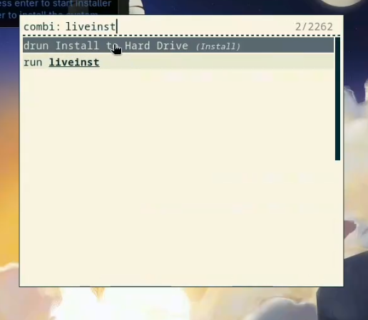{#fig-001 width=70%}

2) Удалила оптический диск ([рис. @fig-002]).

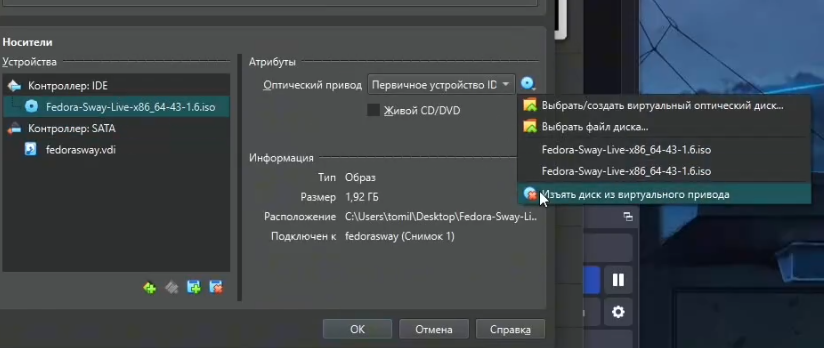{#fig-002 width=70%}

3) Обновила средства разработки ([рис. @fig-003]).

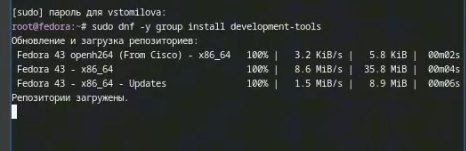{#fig-003 width=70%}

4) Обновила все пакеты ([рис. @fig-004]).

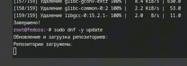{#fig-004 width=70%}

5) Ввела команду для удобства работы в консоли ([рис. @fig-005]).

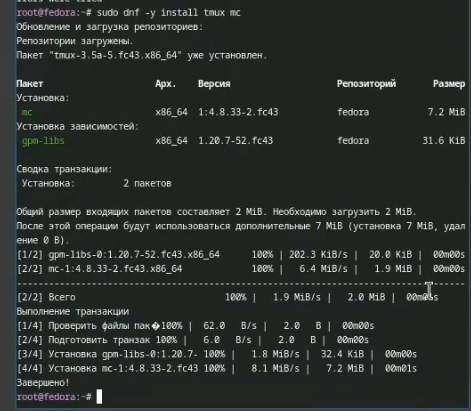{#fig-005 width=70%}

6) Ввела вторую команду для удобства работы в консоли ([рис. @fig-006]).

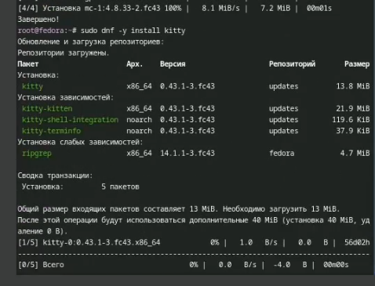{#fig-006 width=70%}

7) При необходимости можно использовать автоматическое обновление. Установка программного обеспечения ([рис. @fig-007]).

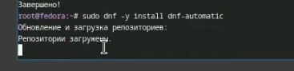{#fig-007 width=70%}

8) Запустите таймер ([рис. @fig-008])

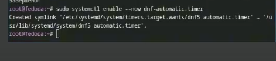{#fig-008 width=70%}

9) Отключение selinux и перезапуск машины ([рис. @fig-009])

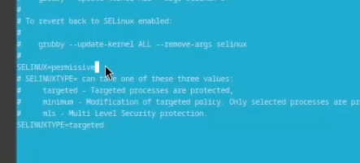{#fig-009 width=70%}

10) Войдите в ОС под заданной вами при установке учётной записью.
Нажмите комбинацию Win+Enter для запуска терминала.
Запустите терминальный мультиплексор tmux.
Создайте конфигурационный файл.([рис. @fig-010]).

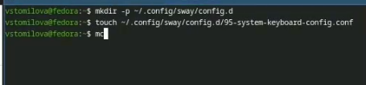{#fig-010 width=70%}

11) Отредактируйте конфигурационный файл ~/.config/sway/config.d/95-system-keyboard-config.conf: exec_always /usr/libexec/sway-systemd/locale1-xkb-config --oneshot ([рис. @fig-011]).

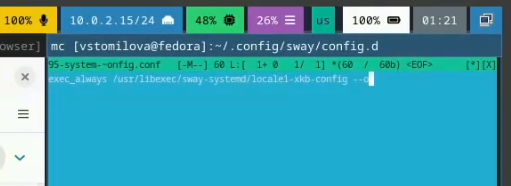{#fig-011 width=70%}

12) Переключитесь на роль супер-пользователя:
([рис. @fig-012).

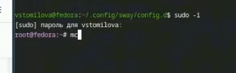{#fig-012 width=70%}

13) Отредактируйте конфигурационный файл /etc/X11/xorg.conf.d/00-keyboard.conf ([рис. @fig-013]).

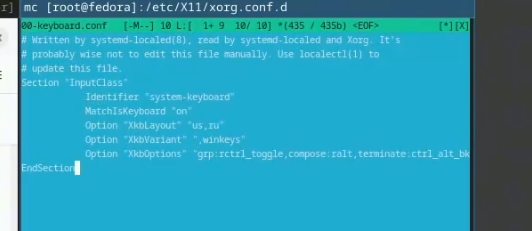{#fig-013 width=70%}

14) Перезапускаем машину ([рис. @fig-014])

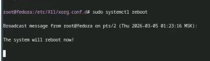{#fig-014 width=70%}

15) Установим pandoc ([рис. @fig-015])

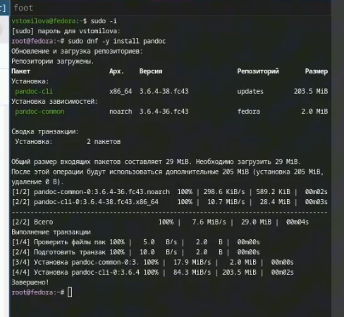{#fig-015 width=70%}

16) Установим pandoc ([рис. @fig-016])

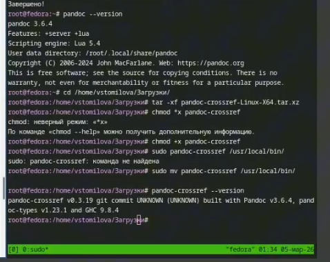{#fig-016 width=70%}

17) Установим texlive ([рис. @fig-017])

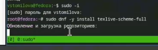{#fig-017 width=70%}

18) Домашняя работа ([рис. @fig-018])

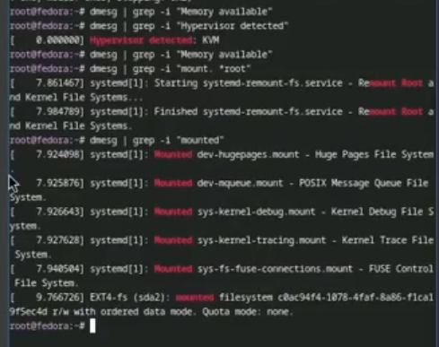{#fig-018 width=70%}

19) Домашняя работа ([рис. @fig-019])

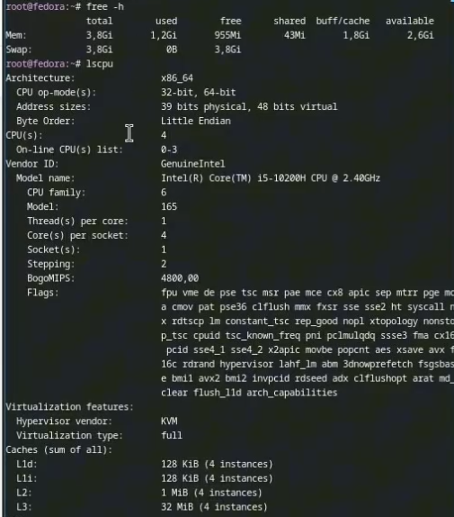{#fig-019 width=70%}

# Выводы

Я установила Линукс на VirtualBox и выполнила первоначальную настройку.

# Список литературы

https://esystem.rudn.ru/mod/page/view.php?id=1358180
:::
