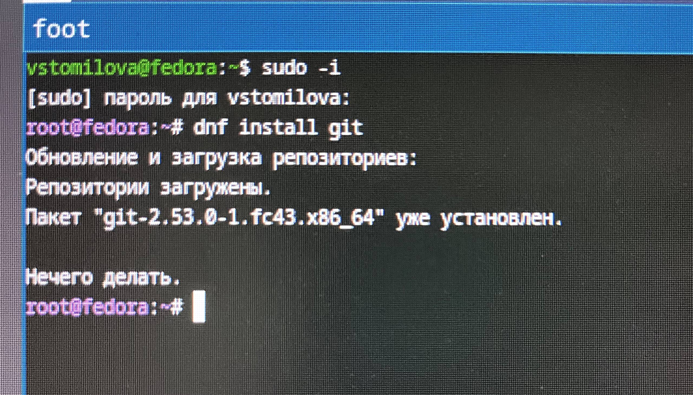
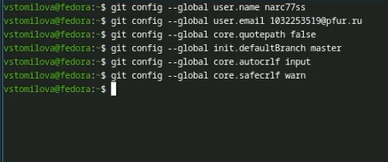
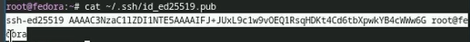
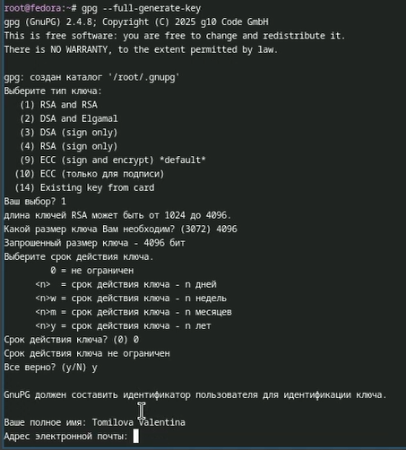
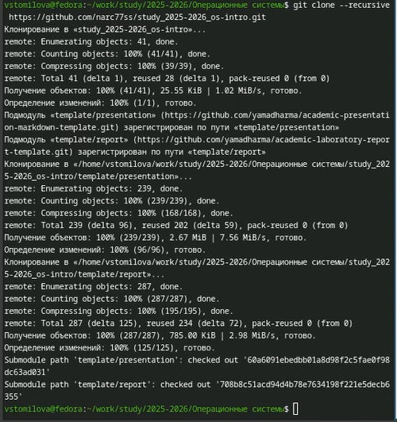

---
## Front matter
lang: ru-RU
title: Отчет по лабораторной работе №2
subtitle: Операционные системы
author:
  - Томилова Валентина Станиславовна 
institute:
  - Российский университет дружбы народов, Москва, Россия

## i18n babel
babel-lang: russian
babel-otherlangs: english

## Formatting pdf
toc: false
toc-title: Содержание
slide_level: 2
aspectratio: 169
section-titles: true
theme: metropolis
bibliography: _resources/cite.bib
csl: _resources/gost-r-7-0-5-2008-numeric.csl

---

# Информация

## Докладчик

  * Томилова Валентина Станиславовна
  * НКАбд-06-25, Студенческий билет: 1032253519
  * Российский университет дружбы народов

## Цель работы

Целью работы является изучение работы и применения средств контроля версий и освоение умения по работе с git.

## Задание

1. Создать базовую конфигурацию для работы с git, ключ ssh, ключ pgp, подписи git, локальный каталог для выполнения и прикрепления заданий по предмету.

---

## Теоретическое введение

Системы контроля версий (Version Control System, VCS) используются для организации совместной работы коллектива над общим проектом. Как правило, основная ветка разработки хранится в репозитории — локальном или удаленном, — к которому организован доступ всех участников. Когда разработчики вносят правки, VCS позволяет регистрировать эти изменения, объединять результаты работы разных специалистов, а при необходимости — выполнять возврат к любой из более ранних версий проекта.

## Выполнение лабораторной работы

1) Переключимся на суперпользователя командой "sudo -i"  и установим git  (рис.1).

{#fig-001 width=70%}

##

2) Установим gh (рис.2).

.png){#fig-002 width=70%}

##

3) Настроим git. Зададим имя и email владельца репозитория. Настроим utf-8 в выводе сообщений git. Зададим имя начальной ветки (будем называть её master) (рис.3).

{#fig-003 width=70%}

##

4) Добавим параметр autocrlf и параметр safecrlf (рис.4).

{#fig-004 width=70%}

##

5) Создадим ключ ssh по алгоритму rsa (рис.5).

{#fig-005 width=70%}

##

6) Создадим ключ ssh по алгоритму ed25519 (рис.6).

{#fig-006 width=70%}

##

7) Выведем ключ в терминале (рис.7).

{#fig-007 width=70%}

##

8) Генерируем ключ gpg (рис.8-9).

{#fig-008 width=70%}
{#fig-009 width=70%}

##

9)Выводим список ключей и копируем отпечаток приватного ключа. Cкопируем сгенерированный PGP ключ в буфер обмена. (рис.10).

{#fig-010 width=70%}

##

10) Настроим автоматические подписи коммитов git и авторизуемся в GitHub через gh (рис.11).

{#fig-011 width=70%}

##

11) Создадим репозиторий курса на основе шаблона (рис.12).

{#fig-012 width=70%}

##

12) Выполним клонирование репозитория (рис.13).

{#fig-013 width=70%}

##

13) Настроим каталог курса (рис.14).

{#fig-014 width=70%}

##

14) Отправим файлы на сервер (рис.15).

{#fig-015 width=70%}

## Выводы

В результате выполнения данной лабораторной работы я приобрела навыки, необходимые для работы с git, настроила каталоги курса для дальнейшей работы, создала ssh и gpg ключи и авторизовалась в gh.

