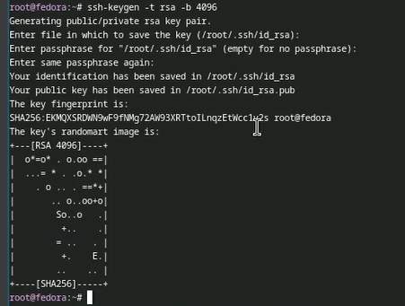
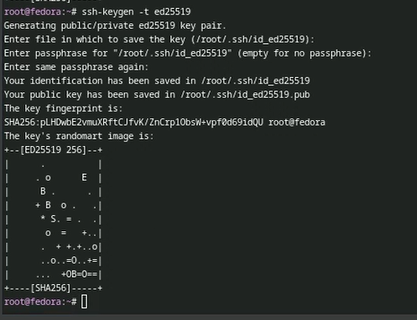
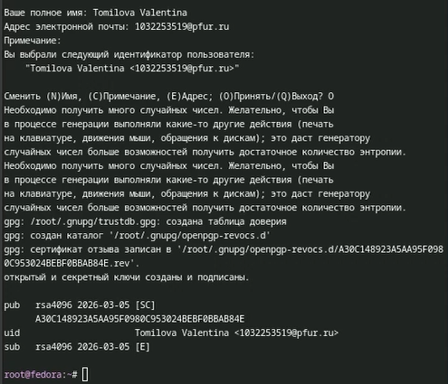
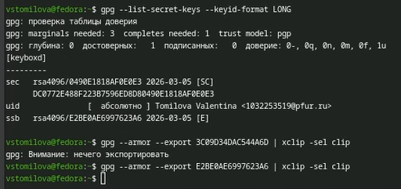
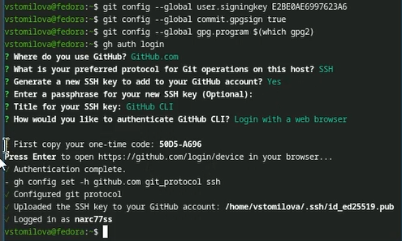
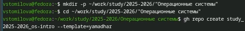
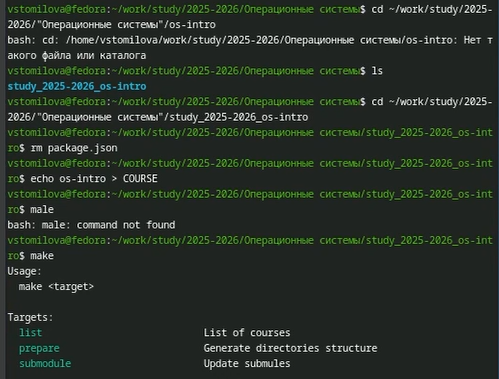
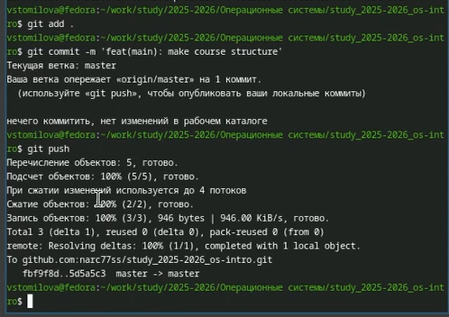

# Цель работы

Изучить идеологию и применение средств контроля версий. Освоить умения по работе с git.

# Задание

Создать базовую конфигурацию для работы с git. Создать ключ SSH. Создать ключ PGP. Настроить подписи git. Зарегистрироваться на Github. Создать локальный каталог для выполнения заданий по предмету.

# Теоретическое введение

Системы контроля версий (Version Control System, VCS) применяются при работе нескольких человек над одним проектом. Обычно основное дерево проекта хранится в локальном или удалённом репозитории, к которому настроен доступ для участников проекта. При внесении изменений в содержание проекта система контроля версий позволяет их фиксировать, совмещать изменения, произведённые разными участниками проекта, производить откат к любой более ранней версии проекта, если это требуется.

В классических системах контроля версий используется централизованная модель, предполагающая наличие единого репозитория для хранения файлов. Выполнение большинства функций по управлению версиями осуществляется специальным сервером. Участник проекта (пользователь) перед началом работы посредством определённых команд получает нужную ему версию файлов. После внесения изменений, пользователь размещает новую версию в хранилище. При этом предыдущие версии не удаляются из центрального хранилища и к ним можно вернуться в любой момент. Сервер может сохранять не полную версию изменённых файлов, а производить так называемую дельта-компрессию — сохранять только изменения между последовательными версиями, что позволяет уменьшить объём хранимых данных.

Системы контроля версий поддерживают возможность отслеживания и разрешения конфликтов, которые могут возникнуть при работе нескольких человек над одним файлом. Можно объединить (слить) изменения, сделанные разными участниками (автоматически или вручную), вручную выбрать нужную версию, отменить изменения вовсе или заблокировать файлы для изменения. В зависимости от настроек блокировка не позволяет другим пользователям получить рабочую копию или препятствует изменению рабочей копии файла средствами файловой системы ОС, обеспечивая таким образом, привилегированный доступ только одному пользователю, работающему с файлом.

Системы контроля версий также могут обеспечивать дополнительные, более гибкие функциональные возможности. Например, они могут поддерживать работу с несколькими версиями одного файла, сохраняя общую историю изменений до точки ветвления версий и собственные истории изменений каждой ветви. Кроме того, обычно доступна информация о том, кто из участников, когда и какие изменения вносил. Обычно такого рода информация хранится в журнале изменений, доступ к которому можно ограничить.

В отличие от классических, в распределённых системах контроля версий центральный репозиторий не является обязательным.

Среди классических VCS наиболее известны CVS, Subversion, а среди распределённых — Git, Bazaar, Mercurial. Принципы их работы схожи, отличаются они в основном синтаксисом используемых в работе команд.

# Выполнение лабораторной работы

1) Переключимся на суперпользователя командой "sudo -i"  и установим git  ([рис. @fig-001]).

{#fig-001 width=70%}

2) Установим gh ([рис. @fig-002]).

.png){#fig-002 width=70%}

3) Настроим git. Зададим имя и email владельца репозитория. Настроим utf-8 в выводе сообщений git. Зададим имя начальной ветки (будем называть её master) ([рис. @fig-003]).

{#fig-003 width=70%}

4) Добавим параметр autocrlf и параметр safecrlf ([рис. @fig-004]).

{#fig-004 width=70%}

5) Создадим ключ ssh по алгоритму rsa ([рис. @fig-005]).

{#fig-005 width=70%}

6) Создадим ключ ssh по алгоритму ed25519 ([рис. @fig-006]).

{#fig-006 width=70%}

7) Выведем ключ в терминале ([рис. @fig-007]).

{#fig-007 width=70%}

8) Генерируем ключ gpg ([рис. @fig-008]) , ([рис. @fig-009]).

{#fig-008 width=70%}

{#fig-009 width=70%}

9)Выводим список ключей и копируем отпечаток приватного ключа. Cкопируем сгенерированный PGP ключ в буфер обмена. ([рис. @fig-010])

{#fig-010 width=70%}

10) Настроим автоматические подписи коммитов git и авторизуемся в GitHub через gh ([рис. @fig-011]).

{#fig-011 width=70%}

11) Создадим репозиторий курса на основе шаблона ([рис. @fig-012]).

{#fig-012 width=70%}

12) Выполним клонирование репозитория ([рис. @fig-013]).

{#fig-013 width=70%}

13) Настроим каталог курса ([рис. @fig-014]).

{#fig-014 width=70%}

14) Отправим файлы на сервер ([рис. @fig-015])

{#fig-015 width=70%}

# Выводы

В результате выполнения данной лабораторной работы я приобрела навыки, необходимые для работы с git, настроила каталог курса для дальнейшей работы, создала ssh и gpg ключи и авторизовадась в gh.

# Ответы на контрольные вопросы.

1. Инструменты для хранения, отслеживания и управления изменениями в файлах проекта, позволяют возвращаться к предыдущим версиям и работать в команде.

2. Основные понятия VCS:

Хранилище - место, где сохраняются все версии проекта.
Commit - зафиксированное изменение в истории.
История - последовательность всех коммитов.
Рабочая копия - локальные файлы пользователя для редактирования.

3. Централизованные (например, CVS, Subversion) - есть один сервер, все работают с ним.
Децентрализованные (например, Git, Mercurial) - у каждого есть полное хранилище, работа возможна без постоянного соединения.

4. Работа с VCS при единоличной работе:

Инициализация репозитория (git init)
Добавление файлов (git add)
Коммит (git commit)
Просмотр истории (git log)
Внесение изменений и повторный коммит

5. Работа с общим хранилищем:

Получение обновлений (git pull)
Внесение изменений (git add, git commit)
Отправка изменений (git push)

6. Основные задачи git:

Хранение версий, ветвление и слияние, работа в команде, восстановление предыдущих состояний.

7. Ключевые команды git:

git init - создание репозитория
git clone - копирование удаленного репозитория
git add - подготовка изменений
git commit - фиксирование изменений
git push - отправка на сервер
git pull - обновление локального репозитория
git branch - управление ветками
git merge - слияние ветвей

8. Локальный: git init, git add, git commit. Удаленный: git clone, git push, git pull

9. Ветви (branches) позволяют параллельно разрабатывать разные функции. При необходимости объединять их с основной линией разработки.

10. Для исключения ненужных или временных файлов создайте .gitignore, чтобы они не попадали в коммиты.

# Список литературы

https://esystem.rudn.ru/mod/page/view.php?id=1358183
