---
## Title
title: "Лабораторная работа №5"
subtitle: "Архитектура компьютера"
license: "Томилова Валентина Станиславовна"
---

## Докладчик

  * Томилова Валентина Станиславовна
  * НКАбд-06-25 
  * Российский университет дружбы народов им. П. Лумумбы
  * 1032253519

## Цель работы

Ознакомиться с pass, gopass, native messaging, chezmoi, а также научиться пользоваться утилитами, синхронизовать их с гит

## Задания

Установить дополнительное ПО, установить и настроить pass, настроить интерфейс с браузером, сохранить пароли, установить и настроить chezmoi

## Теоретическое введение

pass — стандартный Unix-менеджер паролей: данные хранятся в ФС в виде файлов, каждый зашифрован GPG-ключом. Структура хранилища произвольна (семантика в голове), но для интеграции со сторонним ПО её нужно закладывать явно.

chezmoi управляет dotfiles. Исходники лежат в ~/.local/share/chezmoi (клон репозитория), локальный конфиг — в ~/.config/chezmoi/chezmoi.toml. Одинаковые на всех машинах файлы копируются без изменений; различающиеся обрабатываются как шаблоны с подстановкой данных из локального конфига.

## Выполнение лабораторной работы

## Установим pass  

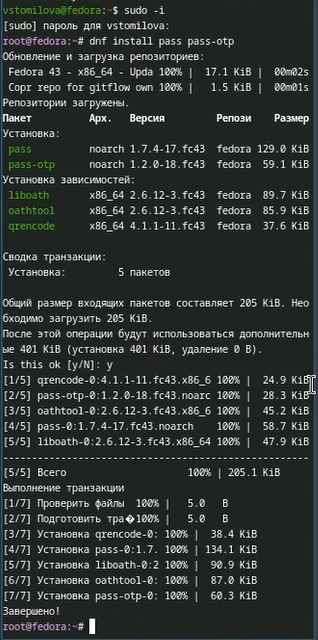{#fig-001 width=70%}

## Установим gopass 

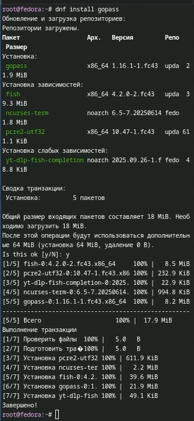{#fig-002 width=70%}

## Просмотрим список ключей:

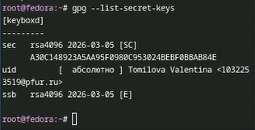{#fig-003 width=70%}

## Инициализируем хранилище: 

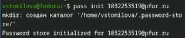{#fig-004 width=70%}

## Создадим структуру git:

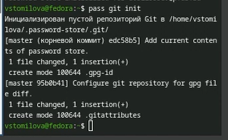{#fig-005 width=70%}

## Создаем репозиторий 

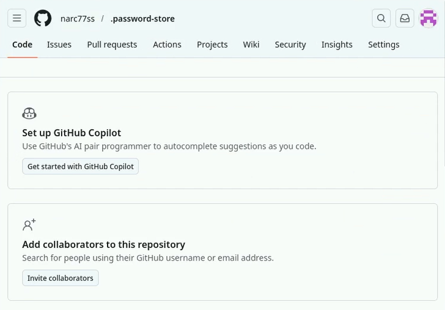{#fig-006 width=70%}

## Зададим адрес репозитория на хостинге 

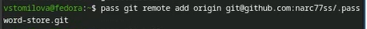{#fig-007 width=70%}

## Сделаем прямые изменения 

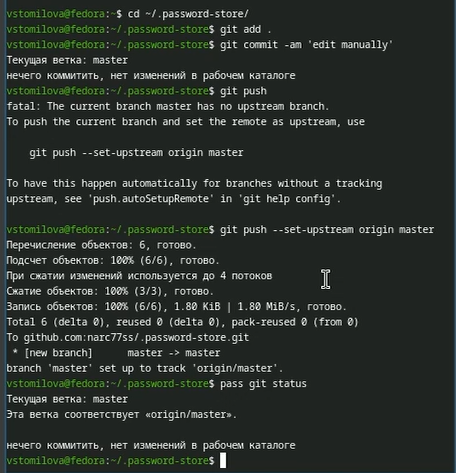{#fig-008 width=70%}

## Настроим интерфейс с броузером 

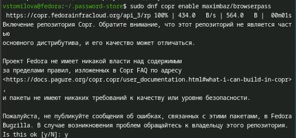{#fig-009 width=70%}

## Добавим новый пароль

![pass insert [OPTIONAL DIR]/[FILENAME]](image/11.png){#fig-011 width=70%}

## Отобразим пароль для указанного имени файла:

![pass [OPTIONAL DIR]/[FILENAME]](image/12.png){#fig-012 width=70%}

## Заменим существующий пароль:

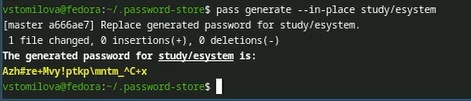{#fig-013 width=70%}

## Установим дополнительное программное обеспечение:

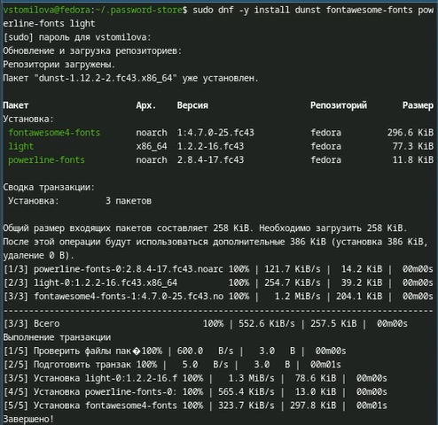{#fig-014 width=70%}

## Установим шрифты: 

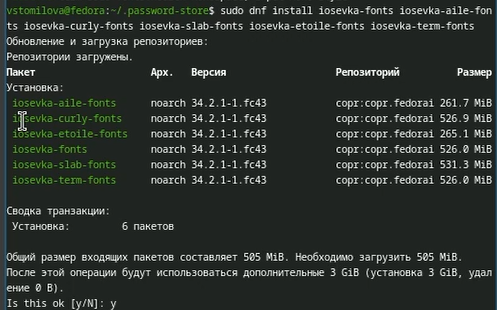{#fig-018 width=70%}

## Установим бинарный файл 

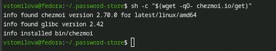{#fig-019 width=70%}

## Создадим свой репозиторий для конфигурационных файлов на основе шаблона:

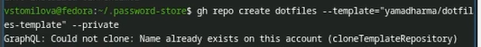{#fig-020 width=70%}

## Инициализируем chezmoi с нашим репозиторием dotfiles:

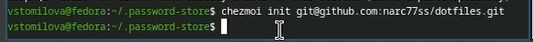{#fig-021 width=70%}

## chezmoi init git@github.com:<username>/dotfiles.git 

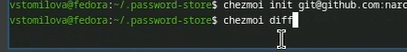{#fig-022 width=70%}

## Выводы

Мы ознакомились с pass, gopass, native messaging, chezmoi, научились использовать утилиты, синхронизировать их с git
