---
## Title
title: "Лабораторная работа №6"
subtitle: "Архитектура компьютеров и операционных систем"
license: "Томилова Валентина Станиславовна"
---

## Докладчик

  * Томилова Валентина Станиславовна
  * НКАбд-06-25 
  * Российский университет дружбы народов им. П. Лумумбы
  * 1032253519
  
## Цель работы

Приобретение практических навыков взаимодействия пользователя с системой посредством командной строки.

## Задания

Определить полное имя домашнего каталога, Перейти в /tmp, вывести содержимое с разными опциями ls, Проверить наличие /var/spool/cron, Вернуться в домашний каталог, вывести содержимое, определить владельцев, Создать ~/newdir и ~/newdir/morefun, Создать и сразу удалить letters, memos, misk одной командой, Попытаться удалить ~/newdir через rm, проверить, Удалить ~/newdir/morefun, проверить, Найти опцию ls для рекурсивного просмотра (man), Найти опции ls для сортировки по времени + подробно (man), Изучить man cd, pwd, mkdir, rmdir, rm, пояснить опции, Из истории (history) выполнить команды

## Теоретическое введение

В операционных системах семейства Linux взаимодействие пользователя с системой происходит через командную строку, где команды вводятся построчно. Для этого используются командные интерпретаторы (shell), например, /bin/sh, /bin/csh, /bin/ksh.
Команда — это текст, записанный по определённым правилам, который может содержать аргументы и служит указанием системе выполнить то или иное действие. Обычно команда состоит из имени (первое слово) и следующих за ним опций или аргументов, уточняющих её действие.
Общий формат команды можно представить так:
имя_команды [опции] [аргументы]  

## Выполнение лабораторной работы

## Определим полное имя домашнего каталога. 

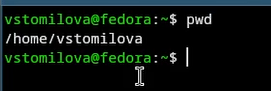{#fig-001 width=70%}

## Перейдем в каталог /tmp 

{#fig-002 width=70%}

## Выведем на экран содержимое каталога /tmp

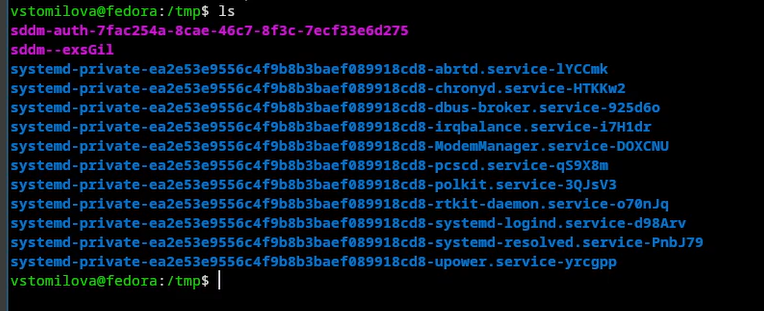{#fig-003 width=70%}

## Выполним команду ls -l, которая показывает права доступа, кол-во ссылок, владельца, группу, размер, дату и время последнего изменения, имя файла

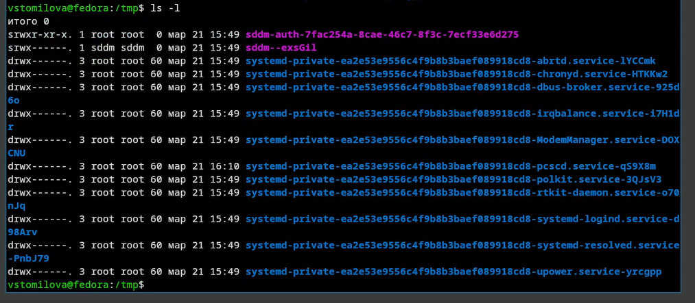{#fig-004 width=70%}

## Выполним команду ls -a, которая показывает все файлы, включая скрытые

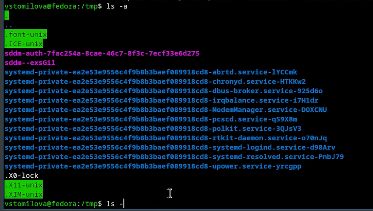{#fig-005 width=70%}

## Выполним команду ls -lh, которая выводит размеры файла в килобайтах/мегабайтах

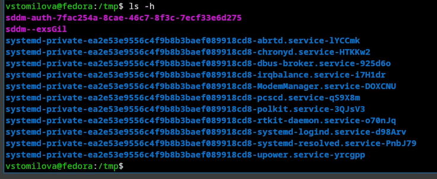{#fig-006 width=70%}

## Выполним команду ls -F, которая добавляет символы-индикаторы

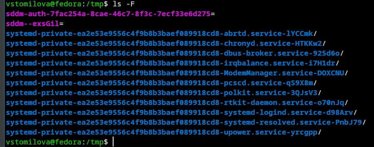{#fig-007 width=70%}

## Выполим команду ls -i, которая выводит inode номер каждого файла 

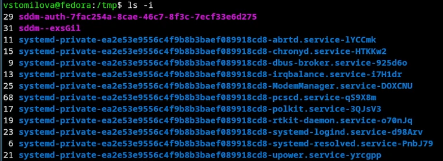{#fig-008 width=70%}

Выполним команду ls -t, которая сортирует файлы по времени последнего изменения 

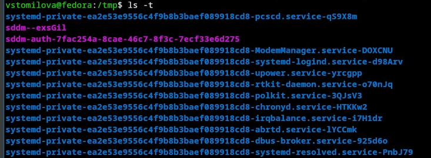{#fig-009 width=70%}

## Определим, есть ли в каталоге /var/spool подкаталог с именем cron 

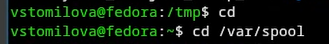{#fig-010 width=70%}

## Перейдите в Ваш домашний каталог и выведите на экран его содержимое.

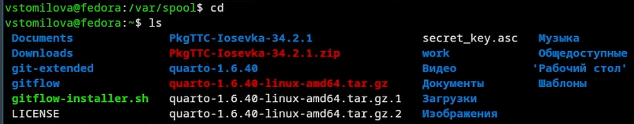{#fig-012 width=70%}

## Определим, кто является владельцем файлов и подкаталогов. Владельцем всех каталогов, кроме gitflow являюсь я, gitflow был создан из root

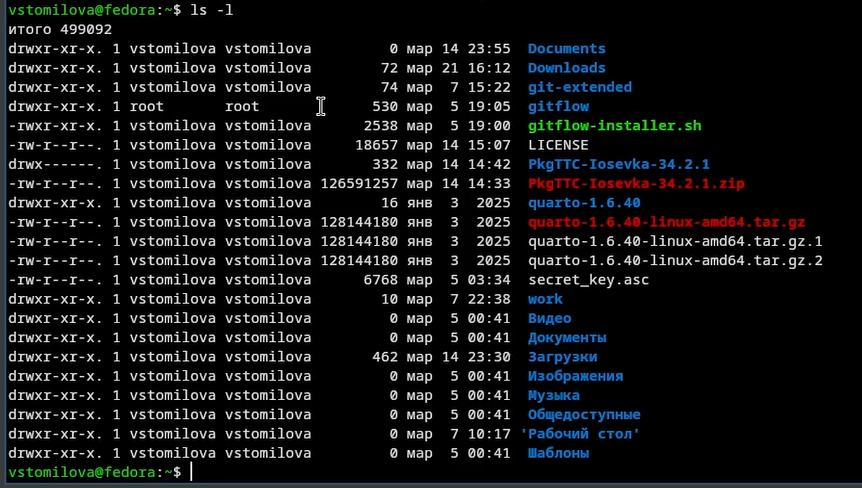{#fig-013 width=70%}

## В домашнем каталоге создайте новый каталог с именем newdir 

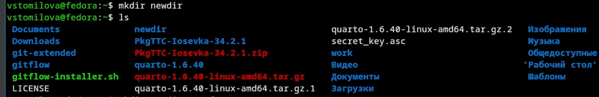{#fig-014 width=70%}

## В каталоге ~/newdir создадим новый каталог с именем morefun

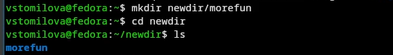{#fig-015 width=70%}

## В домашнем каталоге создайте одной командой три новых каталога с именами letters, memos, misk

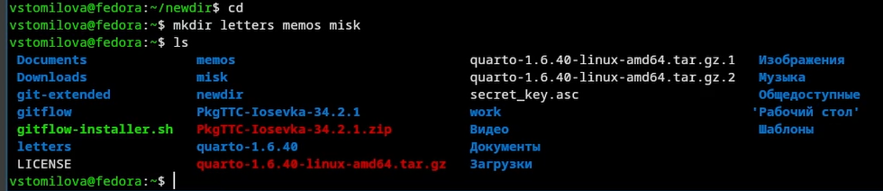{#fig-016 width=70%}

## Затем удалим эти каталоги одной командой

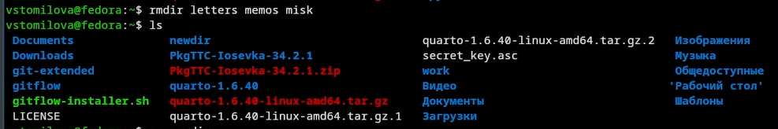{#fig-017 width=70%}

## Попробуем удалить ранее созданный каталог ~/newdir командой rm. Поскольку каталог не пуст, он не удалился 

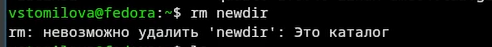{#fig-018 width=70%}

## Удалим каталог ~/newdir/morefun из домашнего каталога. Проверим, был ли каталог удалён.

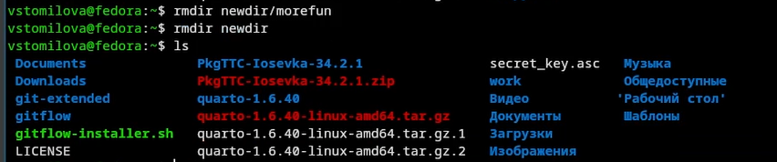{#fig-019 width=70%}

## С помощью команды man определим, какую опцию команды ls нужно использовать для просмотра содержимого не только указанного каталога, но и подкаталогов, входящих в него

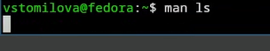{#fig-020 width=70%}

## С помощью команды man определим набор опций команды ls, позволяющую отсортировать по времени последнего изменения выводимый список содержимого каталога с развёрнутым описанием файлов

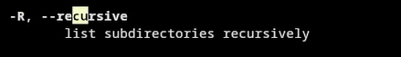{#fig-021 width=70%}
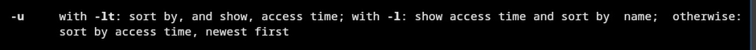{#fig-022 width=70%}

## Используйте команду man для просмотра описания следующих команд: cd, pwd, mkdir,
rmdir, rm. Поясните основные опции этих команд: cd /-перейти в указаный каталог, cd..-перейти на уровень выше, cd ~- в домашний каталог, cd- - в предыдущий каталог. pwd -L- текущий каталог с учетом символических ссылок, -P- выводит реальный руть без символических ссылок. mkdir -p - создает недостающие на пути каталоги, mkdir -m-задает права доступа для нового каталога, mkdir -v- выводит сообщение о каждом созданом каталоге. rmdir -p -удаляет также родительские каталоги, если они становятся пустыми, mkdir -v- показывает, что удаляется. rm -r- рекурсивно удаляет каталоги и их содержимое, rm -f- игнорирует несуществующие файлы, не запрашива подтверждение, rm -i- запрашивает подтверждение перед удалением, rm -v-выводит информацию об удаленных объектах, rm -d- удаляет пустые каталоги

## Выводы

Я приобрела практические навыки взаимодействия пользователя с системой посредством командной строки.
