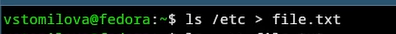
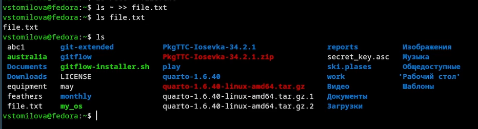
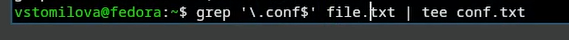
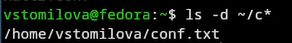
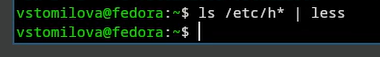
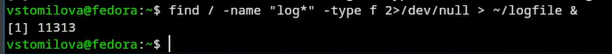
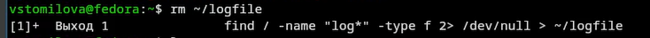
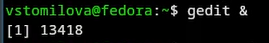
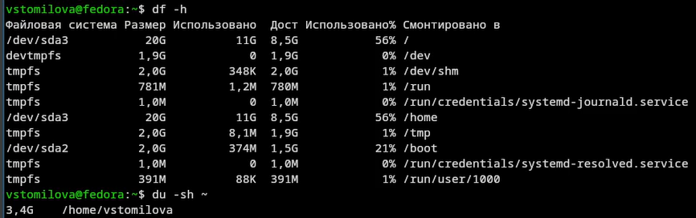
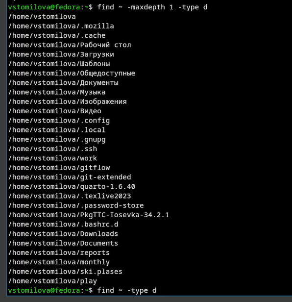

---
## Title
title: "Лабораторная работа №8"
subtitle: "Архитектура компьютеров"
license: "Томилова Валентина Станиславовна"
---

## Докладчик

  * Томилова Валентина Станиславовна
  * НКАбд-06-25 
  * Российский университет дружбы народов им. П. Лумумбы
  * 1032253519

## Цель работы

Ознакомление с инструментами поиска файлов и фильтрации текстовых данных. Приобретение практических навыков: по управлению процессами (и заданиями), по проверке использования диска и обслуживанию файловых систем.

## Задания

Войти в систему под своим пользователем. Записать в file.txt список файлов /etc, затем дописать список файлов домашнего каталога. Из file.txt выбрать строки с расширением .conf, записать их в conf.txt. Найти в домашнем каталоге файлы, имена которых начинаются с c. Предложить несколько способов. Вывести постранично имена файлов из /etc, начинающиеся с h. Запустить в фоне процесс, который записывает в ~/logfile файлы, имена которых начинаются с log. Удалить ~/logfile. Запустить gedit в фоновом режиме. Найти PID процесса gedit с помощью ps и grep. Указать другие способы. Изучить man kill и завершить процесс gedit. Изучить man df и man du, затем выполнить эти команды. С помощью find вывести все директории в домашнем каталоге.

## Теоретическое введение

В системе по умолчанию открыто три стандартных потока:

· stdin (дескриптор 0) — ввод (обычно клавиатура);
· stdout (1) — вывод (обычно консоль);
· stderr (2) — вывод ошибок (консоль).

Команды (например, ls) выводят результат в stdout. Потоки можно перенаправлять:

· > — перенаправление с перезаписью файла;
· >> — добавление в конец файла;
· < — перенаправление ввода из файла.

Конвейер (|) передаёт вывод одной команды на ввод другой.

find — команда поиска файлов по условиям (имя, тип, размер и т.д.).

chezmoi управляет dotfiles. Исходники лежат в ~/.local/share/chezmoi (клон репозитория), локальный конфиг — в ~/.config/chezmoi/chezmoi.toml. Одинаковые на всех машинах файлы копируются без изменений; различающиеся обрабатываются как шаблоны с подстановкой данных из локального конфига.

## Выполнение лабораторной работы

## 1) Осуществим вход в систему, используя соответствующее имя пользователя.  

{#fig-001 width=70%}

## 2)Запишим в файл file.txt названия файлов, содержащихся в каталоге /etc. Допишем в этот же файл названия файлов, содержащихся домашнем каталоге.

{#fig-002 width=70%}

## 3)Выведем имена всех файлов из file.txt, имеющих расширение .conf, после чего запишем их в новый текстовой файл conf.txt.

{#fig-004 width=70%}

## 4) Определим, какие файлы в домашнем каталоге имеют имена, начинающиес с символа c?

{#fig-006 width=70%}

## 5) Выведем на экран (по странично) имена файлов из каталога /etc, начинающиеся с символа h.

{#fig-008 width=70%}

## 6) Запустим в фоновом режиме процесс, который будет записывать в файл ~/logfile файлы, имена которых начинаются с log.

{#fig-009 width=70%}

## 7) Удалим файл ~/logfile.

{#fig-010 width=70%}

## 8) Запустим из консоли в фоновом режиме редактор gedit.

{#fig-011 width=70%}

## 10)Прочтем справку (man) команды kill, после чего используем её для завершения процесса gedit.

{#fig-012 width=70%}

## 11)Выполним команды df и du, предварительно получив более подробную информацию об этих командах, с помощью команды man.

{#fig-013 width=70%}

## 12)Воспользовавшись справкой команды find, выведите имена всех директорий, имею-
щихся в вашем домашнем каталоге. 

{#fig-014 width=70%}

## Выводы

Ознакомилась с инструментами поиска файлов и фильтрации текстовых данных. Приобрела практические навыки: по управлению процессами (и заданиями), по проверке использования диска и обслуживанию файловых систем.

## Контрольные вопросы

1) Потоки: 0 (stdin), 1 (stdout), 2 (stderr)
2) Перенаправление: > — перезапись, >> — добавление
3) | — передает вывод одной команды другой
4) Программа — код, процесс — запущенный экземпляр
5) PID/PPID — ID процесса и родителя; UID/GID — реальные ID пользователя/группы
6) jobs — список фоновых задач
7) top — стандартный монитор, htop — удобнее
8) find /etc -name "*.conf" — поиск файлов
9) grep -rl "текст" / — поиск по содержимому (короче find)
10) df -h — свободное место на дисках
11) du -sh ~ — размер домашнего каталога
12) kill <PID> — завершить процесс; kill %1 — фоновую задачу
