# Цель работы

Изучить основы программирования в оболочке ОС UNIX/Linux. Научиться писать небольшие командные файлы.

# Задание 

1. Написать скрипт, который при запуске будет делать резервную копию самого себя (то есть файла, в котором содержится его исходный код) в другую директорию backup в вашем домашнем каталоге. При этом файл должен архивироваться одним из архиваторов на выбор zip, bzip2 или tar. Способ использования команд архивации необходимо узнать, изучив справку.
2. Написать пример командного файла, обрабатывающего любое произвольное число аргументов командной строки, в том числе превышающее десять. Например, скрипт может последовательно распечатывать значения всех переданных аргументов.
3. Написать командный файл — аналог команды ls (без использования самой этой команды и команды dir). Требуется, чтобы он выдавал информацию о нужном каталоге и выводил информацию о возможностях доступа к файлам этого каталога.
4. Написать командный файл, который получает в качестве аргумента командной строки формат файла (.txt, .doc, .jpg, .pdf и т.д.) и вычисляет количество таких файлов в указанной директории. Путь к директории также передаётся в виде аргумента командной строки.

# Теоретическое введение

В операционной системе UNIX/Linux командный процессор (оболочка, shell) — это интерфейс между пользователем и ядром ОС. Он интерпретирует команды, запускает программы и поддерживает язык программирования (например, bash). Программы на языке оболочки называются **скриптами** или **командными файлами**.

# Выполнение лабораторной работы

1. Подготовим нужные папки и файлы ([рис. @fig-001]).

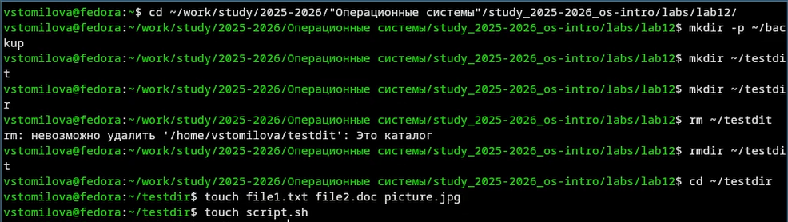{#fig-001 width=70%}

2. Напишем скрипт, который при запуске будет делать резервную копию самого себя (то есть файла, в котором содержится его исходный код) в другую директорию backup в нашем домашнем каталоге.([рис. @fig-002]).

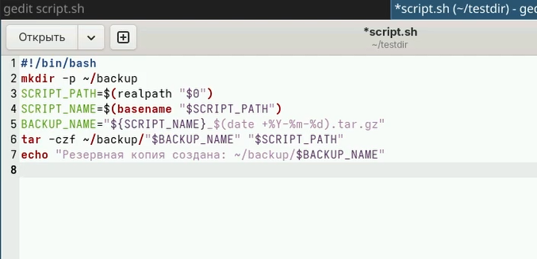{#fig-002 width=70%}

2.1 Проверим работу скрипта([рис. @fig-003]).

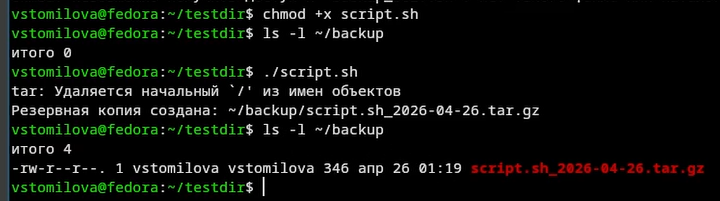{#fig-003 width=70%}

3. Напишем пример командного файла, обрабатывающего любое произвольное число аргументов командной строки, в том числе превышающее десять. Например, скрипт может последовательно распечатывать значения всех переданных аргументов. 

3.1 Создадим файл([рис. @fig-004]).

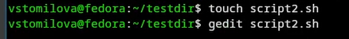{#fig-004 width=70%}

3.2 Напишем код([рис. @fig-005]).

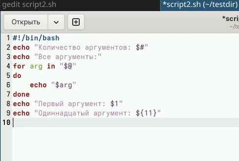{#fig-005 width=70%}

3.3 Проверим работу скрипта([рис. @fig-006]).

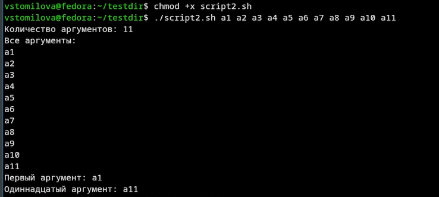{#fig-006 width=70%}

4. Напишем командный файл — аналог команды ls (без использования самой этой команды и команды dir). Требуется, чтобы он выдавал информацию о нужном каталоге и выводил информацию о возможностях доступа к файлам этого каталога.

4.1 Создадим файл([рис. @fig-007]).

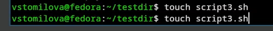{#fig-007 width=70%}

4.2 Напишем код([рис. @fig-008]).

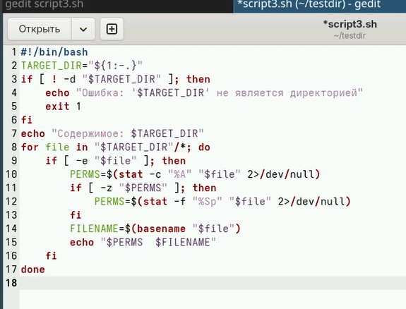{#fig-008 width=70%}

4.3 Проверим его работу([рис. @fig-009]).

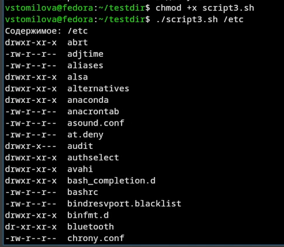{#fig-009 width=70%}

5. Напишем командный файл, который получает в качестве аргумента командной строки формат файла (.txt, .doc, .jpg, .pdf и т.д.) и вычисляет количество таких файлов в указанной директории. Путь к директории также передаётся в виде аргумента командной строки. 

5.1 Создадим 4 файл([рис. @fig-010]).

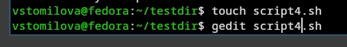{#fig-010 width=70%}

5.2 Напишем код скрипта([рис. @fig-011]).

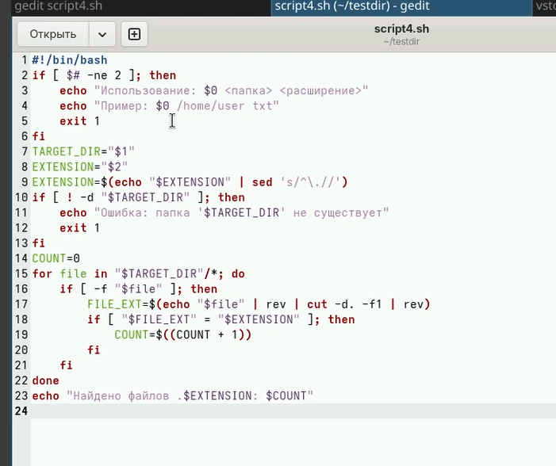{#fig-011 width=70%}

5.3 Создадим исполняемый файл([рис. @fig-012]).

{#fig-012 width=70%}

5.4 Проверим его работу([рис. @fig-013]).

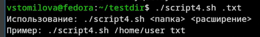{#fig-013 width=70%}

## Выводы

Я изучила основы программирования в оболочке ОС UNIX/Linux. Научилась писать небольшие командные файлы.

## Контрольные вопросы

1. Что такое командная оболочка? Примеры. Чем они отличаются?

Это программа, которая выполняет команды, которые вы вводите.
Примеры: bash, sh, zsh.
Отличия: разный синтаксис, возможности (автодополнение, история).

2. Что такое POSIX?

Стандарт, чтобы программы работали одинаково на разных UNIX-системах.

3. Как создать переменную и массив в bash?

-Переменная: a=5
-Массив: arr=(1 2 3)
-Взять значение: $a, ${arr[0]}

4. Зачем нужны let и read?

- let — для математики (`let a=2+2`)
- read — считать то, что ввел пользователь

5. Какие арифметические операции есть?

'+', '-', '*', '/', '%' (остаток), '**' (степень), сравнения, логические операции.

6. Что значит (( ))?

Конструкция для математики. Пример: `(( a = 5 + 3 ))`

7. Какие стандартные переменные вы знаете?

HOME, PATH, USER, PWD, SHELL

8. Что такое метасимволы?

Символы, которые имеют специальный смысл: *, ?, |, >, <, &, ;, $

9. Как убрать специальный смысл у метасимволов?

- Поставить '\' перед символом: '\*'
- Взять в одиночные кавычки: ''*''
- В двойные ('"*"') — убирает частично

10. Как создать и запустить скрипт?

1. Написать в файле '#!/bin/bash'
2. Дать право на выполнение: 'chmod +x файл'
3. Запустить: './файл'

11. Как создать функцию?

```bash
function имя {
    команды
}

12. Как узнать, файл это или каталог?

С помощью команды `test` или скобок `[ ]`

13. Зачем нужны команды set, typeset и unset?

| Команда | Назначение |
|---------|------------|
| `set` | показывает все переменные и настройки оболочки, а также позволяет изменять параметры работы командного процессора |
| `typeset` | задаёт свойства переменной или функции (например, `-f` — для функций, `-fx` — экспортировать функцию, `-ft` — включить трассировку) |
| `unset` | удаляет переменную или функцию. Для удаления функции используется флаг `-f`: `unset -f имя_функции` |

14. Как передать параметры в скрипт?

Параметры передаются при запуске скрипта через пробел после имени файла:

```bash
./мой_скрипт параметр1 параметр2 параметр3

15. Какие специальные переменные есть в bash?

Специальные переменные — это предопределённые переменные, которые содержат важную информацию о скрипте и его окружении.

| Переменная | Что хранит |
|------------|------------|
| `$0` | имя скрипта |
| `$1`, `$2`, ... | аргументы (1-й, 2-й и т.д.) |
| `$#` | сколько аргументов передали |
| `$*` | все аргументы одной строкой |
| `$?` | код ошибки последней команды (0 — всё хорошо) |
| `$$` | номер процесса (PID) |
| `${#var}` | длина строки в переменной |
