# Цель работы

Изучить основы программирования в оболочке ОС UNIX. Научится писать более сложные командные файлы с использованием логических управляющих конструкций и циклов.

# Задание 

1. Используя команды getopts grep, написать командный файл, который анализирует командную строку с ключами:
– -iinputfile — прочитать данные из указанного файла;
– -ooutputfile — вывести данные в указанный файл;
– -pшаблон — указать шаблон для поиска;
– -C — различать большие и малые буквы;
– -n — выдавать номера строк.
а затем ищет в указанном файле нужные строки, определяемые ключом -p.
2. Написать на языке Си программу, которая вводит число и определяет, является ли оно больше нуля, меньше нуля или равно нулю. Затем программа завершается с помощью функции exit(n), передавая информацию в о коде завершения в оболочку. Командный файл должен вызывать эту программу и, проанализировав с помощью команды $?, выдать сообщение о том, какое число было введено.
3. Написать командный файл, создающий указанное число файлов, пронумерованных последовательно от 1 до 𝑁 (например 1.tmp, 2.tmp, 3.tmp,4.tmp и т.д.). Число файлов, которые необходимо создать, передаётся в аргументы командной строки. Этот же командный файл должен уметь удалять все созданные им файлы (если они существуют).
4. Написать командный файл, который с помощью команды tar запаковывает в архив все файлы в указанной директории. Модифицировать его так, чтобы запаковывались только те файлы, которые были изменены менее недели тому назад (использовать команду find).

# Теоретическое введение

Bash (Bourne Again Shell) — это мощная командная оболочка Unix, которая используется для выполнения различных задач в терминале. Bash предоставляет интерактивный интерфейс, в котором пользователи могут вводить команды, а затем получать результаты. Она также поддерживает скрипты оболочки, которые представляют собой текстовые файлы, содержащие последовательность команд Bash для автоматизации задач. Bash широко используется в средах Unix и Linux, а также поддерживается Windows с помощью подсистемы Windows для Linux (WSL). Перечислим основные возможности этой оболочки. Обработка команд. Bash может обрабатывать как простые, так и сложные команды. Простые состоят из одного действия и, возможно, некоторых аргументов. Сложные команды могут содержать несколько простых, объединенных с помощью операторов конвейера (|), перенаправления ввода и вывода (<, >, >>), условных операторов (if/else, case/esac, while/do). О них мы расскажем позже. Расширенный ввод, редактирование строк. Оболочка предоставляет функции расширенного ввода, такие как автодополнение, которое предлагает возможные варианты завершения команд и имен файлов по мере их ввода. Она также поддерживает историю, позволяя пользователям просматривать ранее введенные команды, а затем повторно их использовать. Возможность создания и запуска скриптов. Скрипты оболочки — это текстовые файлы, содержащие последовательность команд. Их можно создавать с помощью текстового редактора, а затем запускать в терминале, что дает возможность пользователям автоматизировать задачи и управлять системой. Скрипты могут содержать условные операторы, циклы, функции для обеспечения дополнительной гибкости и контроля.

# Выполнение лабораторной работы

1. Создадим файл для первого командного файла и перейдем к редактированию([рис. @fig-001]).

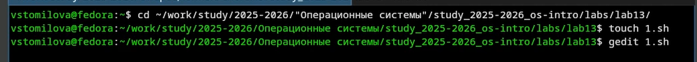{#fig-001 width=70%}

Используя команды getopts grep, написать командный файл, который анализирует командную строку с ключами:
– -iinputfile — прочитать данные из указанного файла;
– -ooutputfile — вывести данные в указанный файл;
– -pшаблон — указать шаблон для поиска;
– -C — различать большие и малые буквы;
– -n — выдавать номера строк.
а затем ищет в указанном файле нужные строки, определяемые ключом -p. ([рис. @fig-002]). ([рис. @fig-003]).

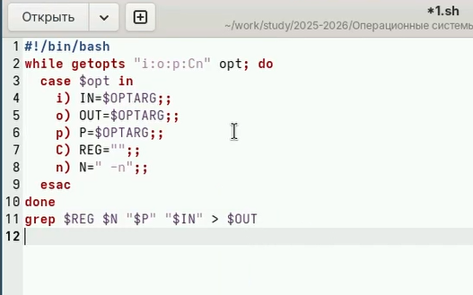{#fig-002 width=70%}

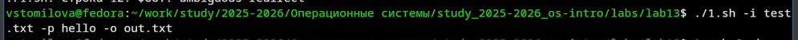{#fig-003 width=70%}

2. Написать на языке Си программу, которая вводит число и определяет, является ли оно больше нуля, меньше нуля или равно нулю. Затем программа завершается с помощью функции exit(n), передавая информацию в о коде завершения в оболочку. Командный файл должен вызывать эту программу и, проанализировав с помощью команды
$?, выдать сообщение о том, какое число было введено. ([рис. @fig-004]). ([рис. @fig-005]). ([рис. @fig-006]). ([рис. @fig-007]). ([рис. @fig-008]).

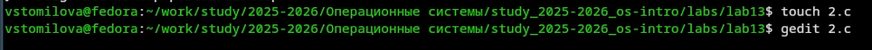{#fig-004 width=70%}

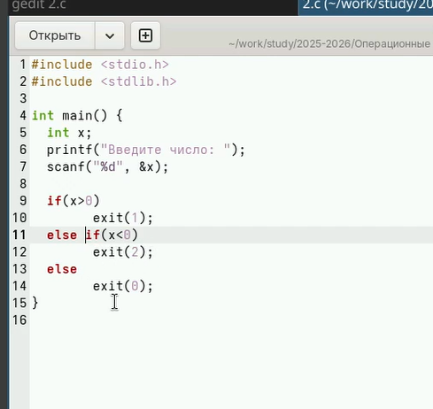{#fig-005 width=70%}

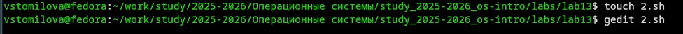{#fig-006 width=70%}

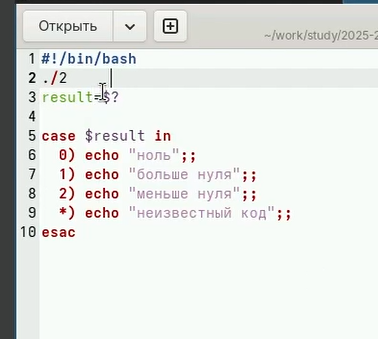{#fig-007 width=70%}

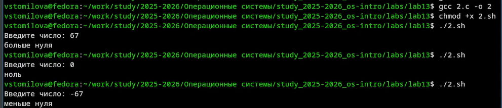{#fig-008 width=70%}

3. Написать командный файл, создающий указанное число файлов, пронумерованных последовательно от 1 до 𝑁 (например 1.tmp, 2.tmp, 3.tmp,4.tmp и т.д.). Число файлов, которые необходимо создать, передаётся в аргументы командной строки. Этот же командный файл должен уметь удалять все созданные им файлы (если они существуют).([рис. @fig-009]). ([рис. @fig-010]). ([рис. @fig-011]). ([рис. @fig-012]). ([рис. @fig-013]). ([рис. @fig-010]).

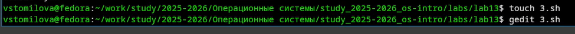{#fig-009 width=70%}

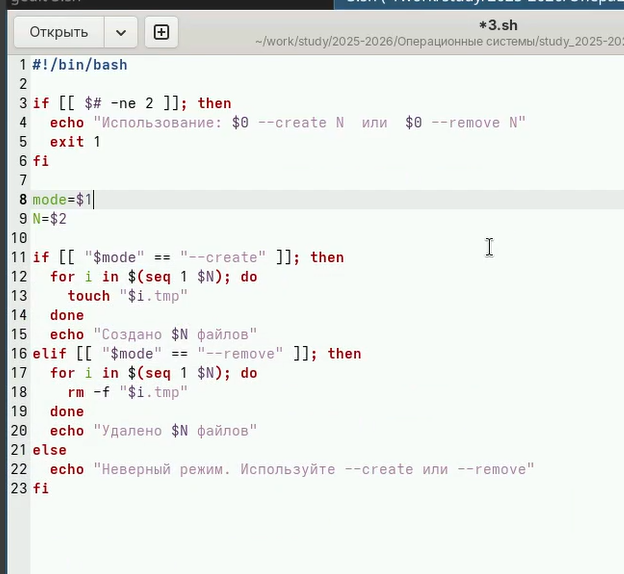{#fig-010 width=70%}

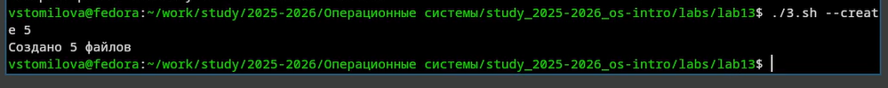{#fig-011 width=70%}

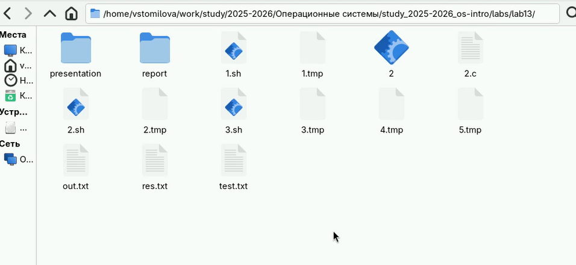{#fig-012 width=70%}

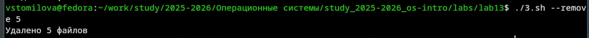{#fig-013 width=70%}

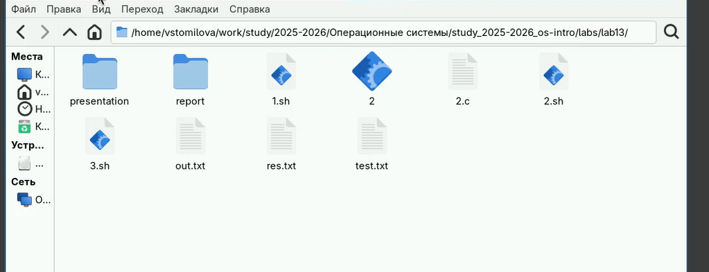{#fig-014 width=70%}

4. 4. Написать командный файл, который с помощью команды tar запаковывает в архив все файлы в указанной директории. Модифицировать его так, чтобы запаковывались только те файлы, которые были изменены менее недели тому назад (использовать команду find). ([рис. @fig-015]). ([рис. @fig-016]). 

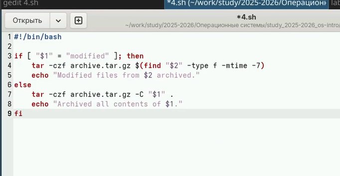{#fig-015 width=70%}

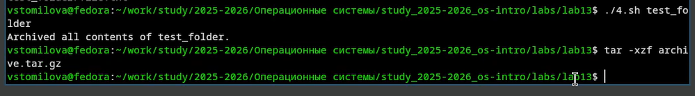{#fig-016 width=70%}

# Выводы

Я изучила основы программирования в оболочке ОС UNIX/Linux. Научилась писать небольшие командные файлы.

# Контрольные вопросы

1) Предназначение getopts — разбор параметров командной строки в скриптах (например, -a, -f файл), автоматическая обработка флагов и их аргументов.

2) Метасимволы (*, ?, []) используются для генерации имён файлов (шаблонов подстановки) — оболочка заменяет их списком подходящих файлов.

3) Операторы управления действиями: && (И), || (ИЛИ), ; (последовательное выполнение), & (фон), | (конвейер), () (подоболочка), а также \, ', " для экранирования/группировки.

4) Операторы прерывания цикла: break (выход из цикла), continue (переход к следующей итерации).

5) true всегда возвращает код 0 (успех), false — код 1 (ошибка). Используются для бесконечных циклов, проверки логики и задержек.

6) if test -f man$s/$i.$s проверяет, является ли файл с путём man$s/$i.$s (например, man1/ls.1) обычным файлом (-f).

7) while выполняет цикл, пока условие истинно (код возврата 0), until — пока условие ложно (код возврата не 0). То есть until работает до первого успешного выполнения условия.
