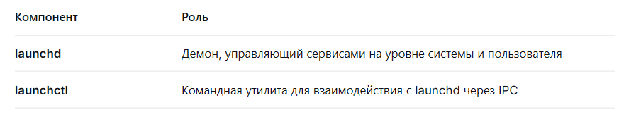
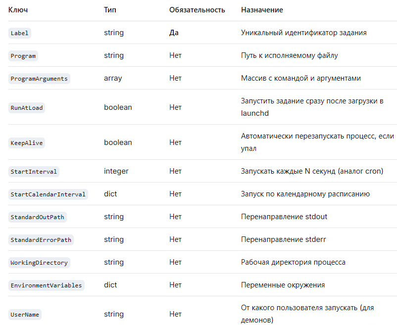
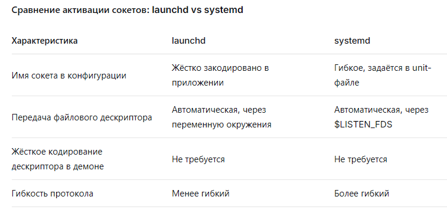

## Докладчик

- Томилова Валентина Станиславовна
- НКАбд-06-25
- Российский университет дружбы народов им. П. Лумумбы
- 1032253519

# Актуальность темы

Современные операционные системы сталкиваются с противоречивыми требованиями: с одной стороны - высокая производительность и мгновенный отклик, с другой - энергоэффективность и экономия ресурсов, особенно на мобильных устройствах. Традиционные системы инициализации (SysVinit, классический init) запускают сервисы линейно и держат их в памяти постоянно, что неоптимально для сред с ограниченным энергопотреблением.

# Объект и предмент исследования

Объектом исследования является система инициализации операционных систем Apple - launchd - как комплексный механизм управления жизненным циклом процессов в пользовательском пространстве, начиная с момента запуска ядра и заканчивая корректным завершением работы системы.

# Введение

Launchd — это унифицированная система инициализации и управления службами в операционных системах Apple (macOS, iOS, tvOS), созданная для замены устаревших механизмов SysVinit и SystemStarter. Это первый процесс пользовательского режима (PID 1), запускаемый ядром, который отвечает за загрузку, остановку и контроль фоновых процессов (демонов и агентов), обеспечивая их работу и перезапуск при сбоях.

Launchd выполняет роль PID 1

## Что такое PID 1

Первый процесс, создаваемый ядром после завершения инициализации аппаратных абстракций.

## Его задачи

Запусить системные и пользовательские сервисы

Перезапустить завершившиеся процессы

Обработать сигналы завершения работы системы

## Иcтория развития

Раньше (Mac OS X Server) использовался init: медленный последовательный запуск, громоздкие скрипты, неэффективное управление процессорами.

2005 год (Mac OS X 10,4 Tiger): Apple представляет launchd.

Цель: заменить init, inetd,cron, xinetd и скрипты запуска одной системой.

## Ключевая идея

Важное значение имеет иерархия. Launchd разделяет сервисы на два типа:

1. Launch Daemons (запуск от root; всегда работают на уровне системы, независимо от входа пользователя.)

2. Launch Agents (запуск от текущего пользователя, живут внутри сессии пользователя)

# Компоненты

{#fig-001 width=70%}

## Архитектура: два главных инструмента

1. launchd: процесс с PID 1. Работает в фоне. Управляет демонами как на уровне системы, так и на уровне пользователя. Может запускать демонов по требованию. Может отслеживать демонов, чтобы убедиться, что они продолжают работать.

## Архитектура: два главных инструмента

2. launchctl: интерфейс командной строки для общения с launchd. Обращается к launchd с использованием IPC. Может использоваться для загрузки и выгрузки демонов, запуска и остановки заданий, получения статистики использования системы для launchd и его дочерних процессов, а также для настройки параметров среды.

## Основные команды

{#fig-002 width=70%}

## Формат конфигурации

Формат конфигурации - Property Lists (.plist). Вместо Bash-скриптов - структурированный XML.

Плюсы: декларативность, легкий парсинг.

{#fig-004 width=70%}

# Главное преимущество

Запуск по требованию. В отличие от классического Linux Init, может держать сервис выключенным, пока он не понадобится. 

События-триггеры: 

1. Path State. Смена пути к файлу. QueueDirectories - запустить обработчик, как только в папку упал файлл.
2. Сокеты(Sockets) - сетевой запрос. Демон "спит", но как только приходит запрос на порт 8080 - launchd его "будит".
3. Время: календарь или интервал.
4. Подключение USB-устройства.

## Сокеты

Сокеты - это механизм активации служб по требованию (socket-based activation), идентификатор (IP+порт), через который программы слушают входящие сообщения. launchd умеет создавать такие идентификаторы сам, без участя программы.

Эту технологию позже позаимствовал systemd.

Дескриптор - номер, которым ядро обозначает открытый сокет.
Сокетная активация - launchd создает дескриптор до запуска сервера.

## Сравнение активации сокетов

{#fig-005 width=70%}

## Работа сокетов

Классическая модель:

Демон открывает сокет, если падает, то сокет закрывается, а подключения теряются.

Модель launchd:

1. launchd создает сокет.
2. Сохраняет файловый дескриптор за собой.
3. При первом входящем соединении запускает целевой сервис.
4. Передает дескриптор через exec() наследнику.

## Плюсы и минусы

## Плюсы

* Универсальность: Заменяет собой cron, init и inetd, управляя всем в одном месте.
* Эффективность: Запускает службы только по требованию (например, при обращении к порту), экономя ресурсы.
* Надежность: Автоматически перезапускает упавшие процессы.
* Скорость: Параллельный запуск ускоряет загрузку системы.

## Минусы

* Синтаксис: Конфигурация через громоздкие XML-файлы (.plist), которые неудобно писать вручную.
* Порог входа: Сложнее в освоении и отладке, чем классический cron.
* Привязка к экосистеме: Полноценно работает только в рамках macOS.

## Влияние на современные ОС

macOS/iOS: launchd - еднственная система инициализации. Все фоновые задачи упакованы в .plist.

Linux: systemd перенес концепции сокетной активации, шины (D-Bus) и юнитов-таймеров.

Windows: службы управления Service Control Manager эволюционировали в сторону триггерных запусков аналогично launchd.

Вывод: launchd задал стандарт событийно-ориентированной инициализации для мобильных и десктопных систем.

# Заключение 

launchd - не просто замена init, а среда управления жизненным циклом процессов.

Основные инновации:

1. Разделение на системный и пользовательский домены.
2. Декларативные конфигурации в XML.
3. Сокетная активация.
4. Запуск по событиям файловой системы и таймерам.

Текущий статус: проприетарная, но архитектурно значимая система, идеи которой стали индустриальным стандартом.

# Список литературы{.unnumbered}

1. https://ru.wikipedia.org/wiki/Launchd
2. https://developer.apple.com/documentation/xpc/launch_activate_socket
3. https://habr.com/ru/articles/38078/
4. file:///home/vstomilova/Downloads/os-intro_lection-07_print.pdf

