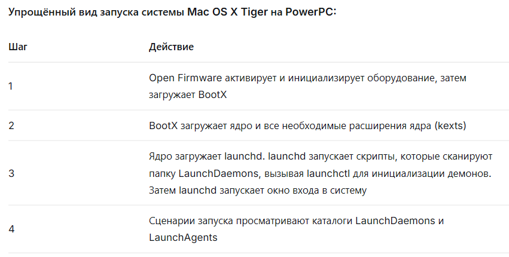
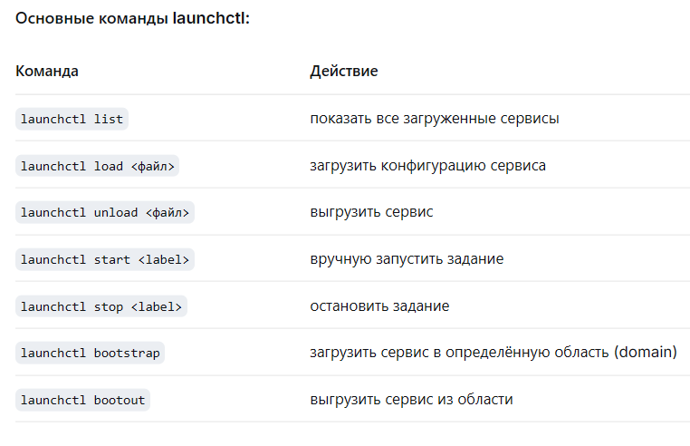

# Введение

launchd - система инициализации в macOS с открытым исходным кодом, созданная для замены SysVinit и SystemStarter. Процесс launchd имеет PID 1 и занимается тем, что запускает другие процессы и перезапускает их в случае сбоя, то есть выполняет функции init (в новых версиях Linux - systemd). Также он заменяет cron.

Процессы, запускаемые после запуска системы до входа в систему, записываются в каталог "/Library/LaunchDaemons". Процессы, запускаемые после входа в систему, находятся в каталоге "/Library/LaunchAgents". В этих каталогах создаются файлы с XML-содержимым, которые управляют запуском процессов.

# 1. История

Программное обеспечение было разработано и написано Дейвом Заржицким в Apple. Компания планировала заменить в среде macOS следующие компоненты:

- init
- rc
- init.d script
- rc.d script
- SystemStarter
- inetd / xinetd
- crond / atd
- watchdogd

Дейв Заржицкий решил написать программу, которая отличалась бы от перечисленных выше и предлагала бы единый, стандартизированный интерфейс для любых программ, запускаемых системой автоматически, а также другие функции.

Большинство из этих программ были отменены, когда launchd был представлен в Mac OS X 10.4 Tiger.

В 2006 году дистрибутив Ubuntu Linux рассматривался с использованием launchd. Эта опция была отклонена, поскольку исходный код был под лицензией Apple Public License - описанной как «неизбежная проблема с лицензией». Вместо этого разработчики Ubuntu разработали и переключились на собственный инструмент управления сервисами Upstart.

В августе 2006 года Apple повторно запустила launchd с лицензией Apache License версии 2.0, чтобы облегчить адаптацию для других разработчиков с открытым исходным кодом. Большинство дистрибутивов Linux используют systemd или Upstart, либо продолжают использовать Init, а BSD-подобные системы также продолжают использовать Init.

В декабре 2013 года Р. Тайлер Крой объявил о своём намерении возобновить работу над своей версией launchd для FreeBSD, и его репозиторий «openlaunchd» на GitHub впоследствии активизировался.

В 2014 году, начиная с OS X 10.10 и iOS 8, Apple переместила код для запуска в libxpc с закрытым исходным кодом.

В августе 2015 года Джордан Хаббард и Кип Мэйси объявили о запуске NextBSD.

# 2. Компоненты

В launchd есть две основные программы: launchd и launchctl.([рис. @fig-001])

{#fig-001 width=70%}

Launchd - управляет демонами как на уровне системы, так и на уровне пользователя. Как и xinetd, launchd может запускать демонов по требованию. Как и watchdogd, launchd может отслеживать демонов, чтобы убедиться, что они продолжают работать.

Launchctl - это приложение командной строки, которое обращается к launchd с использованием IPC и знает, как анализировать файлы, используемые для описания запускаемых заданий, и сериализовывать их с использованием специализированного словарного протокола, который понимает launchd. launchctl может использоваться для загрузки и выгрузки демонов, запуска и остановки заданий, получения статистики использования системы для launchd и его дочерних процессов, а также для настройки параметров среды.

## 2.1 launchd

У launchd есть две основные задачи. Первая - загрузить систему. Вторая - загрузка и обслуживание сервисов.([рис. @fig-002])

{#fig-002 width=70%}

Сценарии запуска просматривают несколько разных каталогов для выполнения заданий. Сканируются два разных каталога:

- Каталоги LaunchDaemons содержат элементы, которые будут запускаться от имени пользователя root, обычно это фоновые процессы.
- Каталоги LaunchAgents содержат задания, называемые агентскими приложениями, которые будут запускаться от имени пользователя или в контексте пользовательского пространства. Это могут быть скрипты или другие элементы переднего плана, и они могут даже включать пользовательский интерфейс.

launchd сильно отличается от SystemStarter тем, что он может не запускать все демоны во время загрузки. Ключ к launchd, как и в xinetd, - запуск демонов по требованию. Когда launchctl просматривает списки заданий во время загрузки, он запрашивает у launchd зарезервировать и прослушивать все порты, запрошенные этими заданиями. После загрузки демона launchd будет отслеживать его и при необходимости следить за тем, чтобы он работал. Таким образом, он похож на watchdogd и разделяет требование watchdogd о том, чтобы процессы не пытались разветвляться или демонизироваться самостоятельно. Если процесс уходит в фоновый режим, launchd потеряет его и попытается перезапустить.

Mac OS X Tiger, следовательно, загружается намного быстрее, чем предыдущие версии. Система только регистрирует демонов, которые должны работать, и фактически не запускает их, пока они не понадобятся.

Самая сложная часть для управления во время запуска launchd - это зависимости. SystemStarter имеет очень простую систему зависимостей, которая использует ключи «Использует», «Требуется» и «Предоставляет» в списке элементов запуска. При создании зависимостей для запуска на Tiger существует две основные стратегии: IPC позволяет демонам общаться между собой для выработки зависимостей, или демоны могут просматривать файлы или пути изменений. SystemStarter всё ещё поддерживался до OS X Mountain Lion, но был удалён в OS X Yosemite.

## 2.2 launchctl

В launchd управление службами централизовано в приложении launchctl. Сам по себе launchctl может принимать команды из командной строки, из стандартного входа или работать в интерактивном режиме. С привилегиями суперпользователя launchctl может использоваться для внесения изменений в глобальном масштабе. launchctl связывается с launchd через Mach-специфический механизм IPC.([рис. @fig-003])

{#fig-003 width=70%}

# 3. Список свойств (plist)

Список свойств (plist) - это тип файла, который launchd использует для конфигурации программы. Когда launchd сканирует папку или задание отправляется через launchctl, он читает файл plist, который описывает, как программа должна быть запущена.

Ниже приведён список часто используемых ключей.([рис. @fig-004])

{#fig-004 width=70%}

# 4. Сокеты

Сокеты - это механизм активации служб по требованию (socket-based activation). Это значит, что вместо постоянного запуска программы, launchd сам открывает сетевой порт или сокет домена Unix, слушает его, и только когда на него поступает входящее подключение, он запускает соответствующий сервис.

Имя каждого ключа в разделе «Сокеты» будет помещено в среду задания при его запуске, а файловый дескриптор данного сокета будет доступен в этой переменной среды.([рис. @fig-004])

{#fig-005 width=70%}

Это отличается от активации сокетов в systemd тем, что имя определения сокета внутри конфигурации задания жёстко закодировано в приложении. Этот протокол менее гибок, хотя он, как и systemd, не требует, чтобы демон жёстко закодировал начальный файловый дескриптор.

# Заключение

Таким образом, launchd - это единая система управления процессами, планирования задач и активации по требованию. Она обеспечивает быструю загрузку macOS, экономию ресурсов и унифицированный подход к описанию сервисов через plist-файлы. Понимание принципов работы launchd необходимо для разработки и администрирования в экосистеме Apple.

# Список литературы{.unnumbered}

1. https://ru.wikipedia.org/wiki/Launchd
2. https://developer.apple.com/documentation/xpc/launch_activate_socket
3. https://habr.com/ru/articles/38078/
4. file:///home/vstomilova/Downloads/os-intro_lection-07_print.pdf

