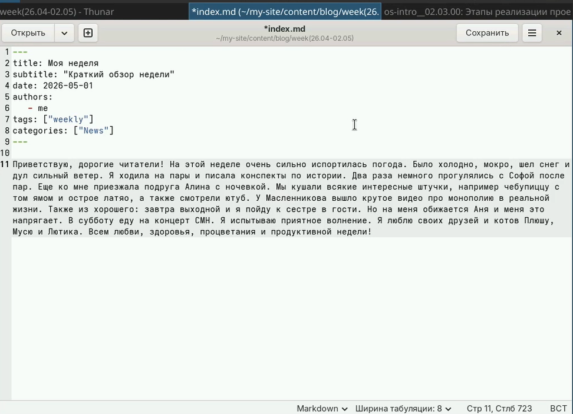
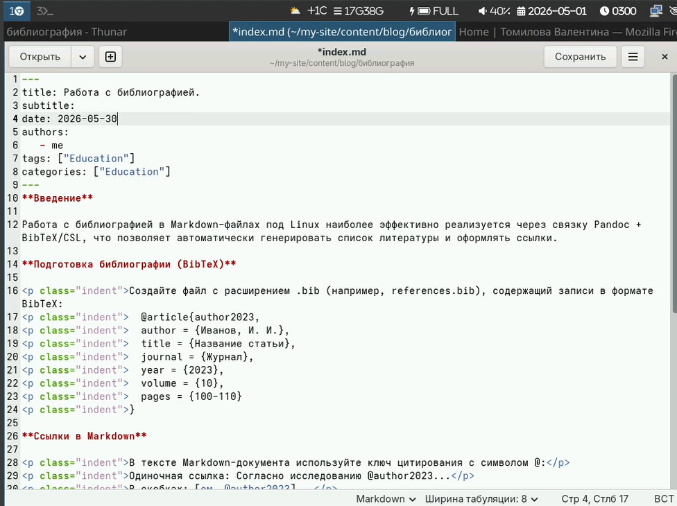
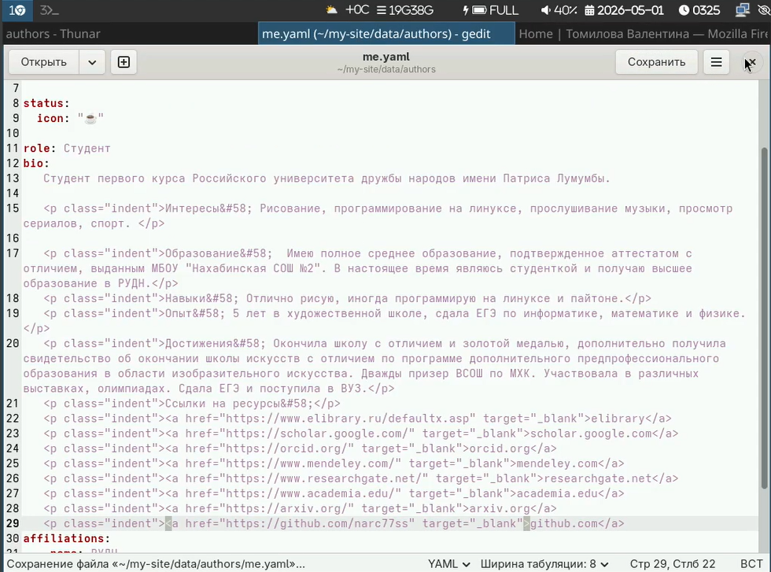
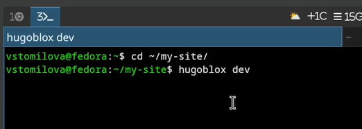
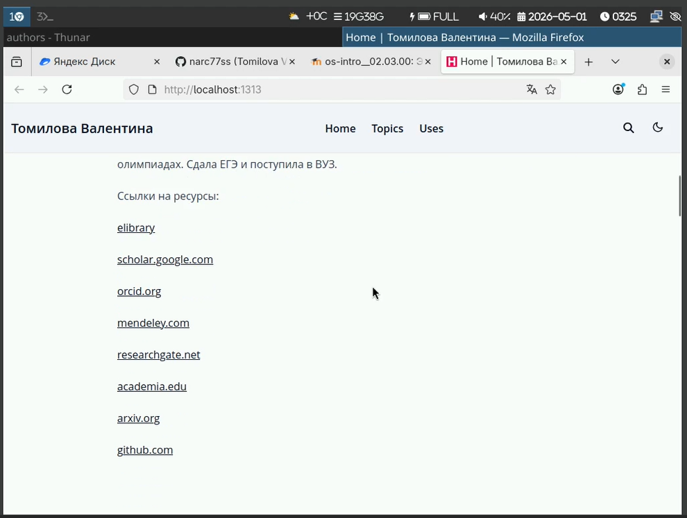
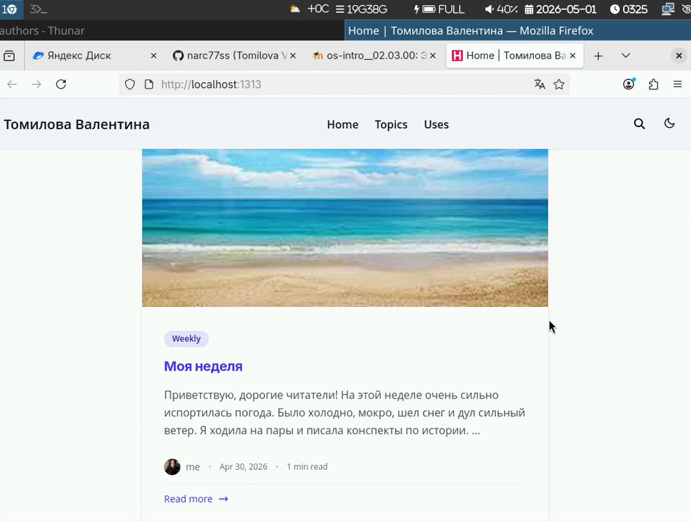
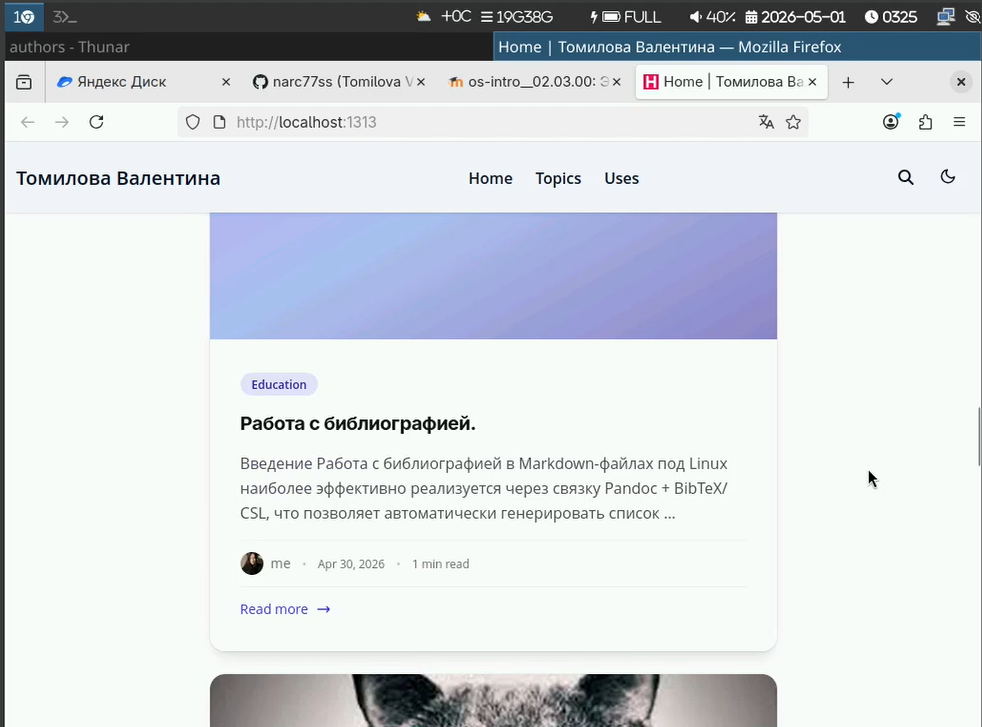
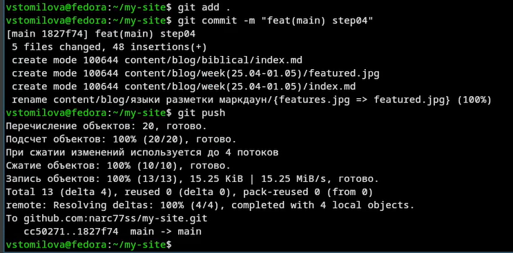

---
## Title
title: "Индивидуальный проект 4 этап"
subtitle: "Архитектура компьютера"
license: "Томилова Валентина Станиславовна"
---

## Докладчик

  * Томилова Валентина Станиславовна
  * НКАбд-06-25 
  * Российский университет дружбы народов им. П. Лумумбы
  * 1032253519

## Цель работы

Научиться редактировать информацию на сайте и делать публикации

## Задание

Добавить на сайт ссылки, сделать пост по прошедшей недели, сделать пост на тему по выбору (библиография)

## Выполнение лабораторной работы

## 1) Заполним файл с информацией по прошедшей неделе 

{#fig-001 width=70%}

## 2) Заполним файл с текстом про библиографию 

{#fig-002 width=70%}

## 3)Добавим ссылки

{#fig-003 width=70%}

## 4) Проверим изменения 

{#fig-004 width=70%}

## 5)Проверим, как отобразились изменения на сайте 

{#fig-005 width=70%}

{#fig-006 width=70%}

{#fig-007 width=70%}

## 6)Отправим на github 

{#fig-008 width=70%}

## Выводы

В ходе выполнения данного этапа индивидуального проекта я добавила ссылки на сайт и сделала два новых поста

