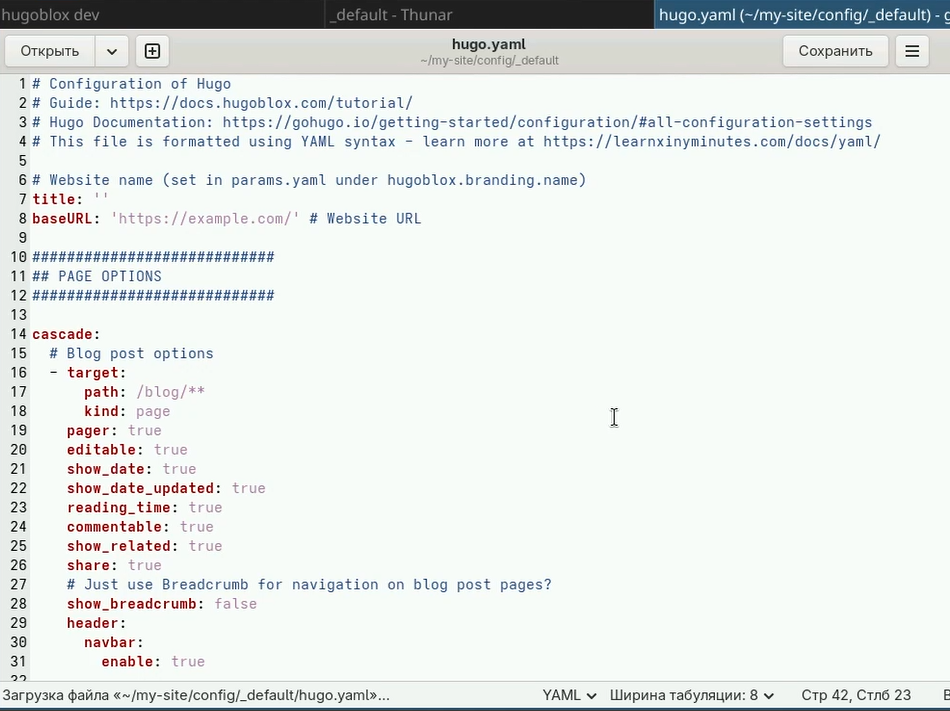
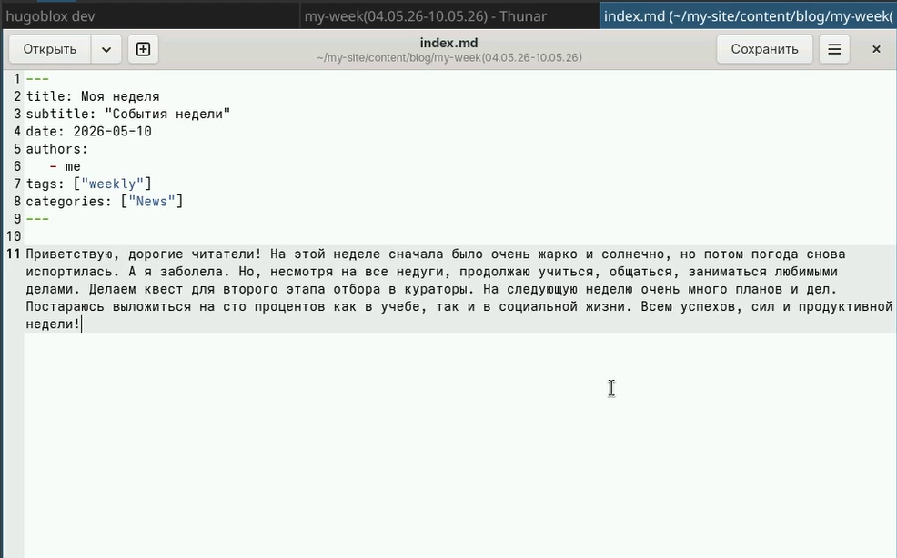
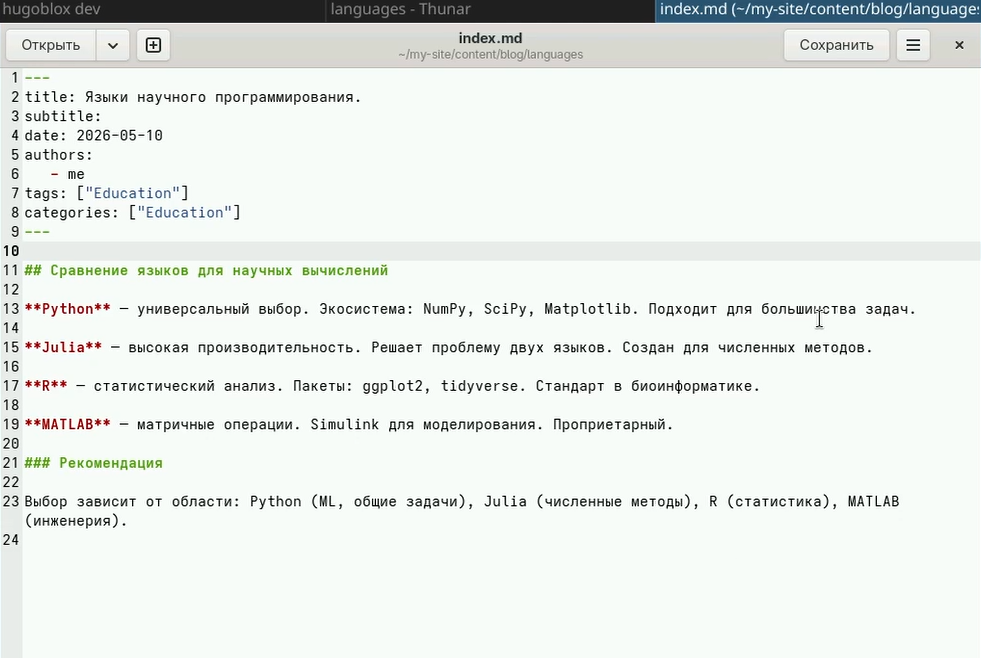
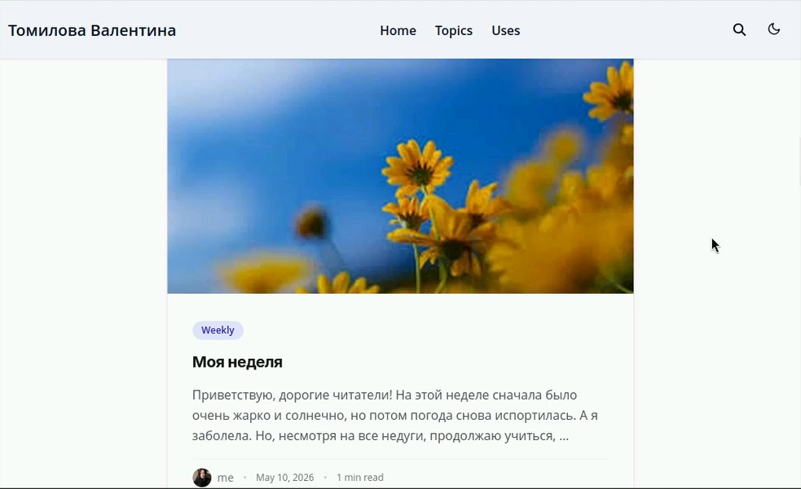
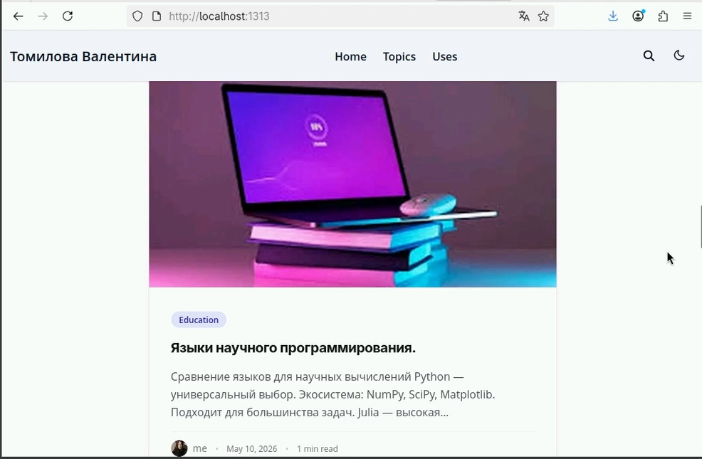
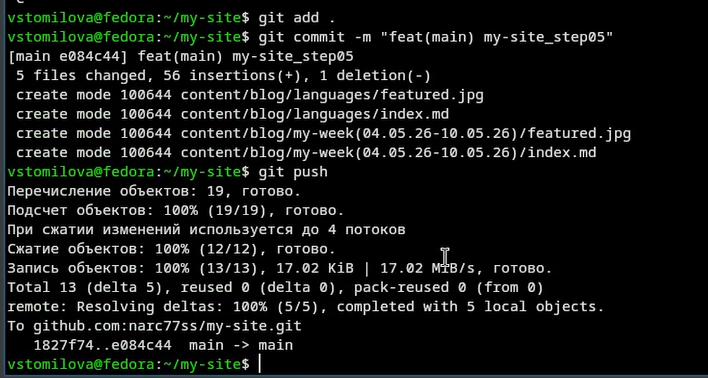

# Цель работы

Научиться редактировать информацию на сайте и делать публикации, сделать записи для персональных проектов.

# Задание

Сделать записи для персональных проектов.
Сделать пост по прошедшей неделе.
Добавить пост на тему по выбору: Языки научного программирования.

# Выполнение лабораторной работы

1) Сделаю записи для персональных проектов ([рис. @fig-001]).

{#fig-001 width=70%}

2) Заполним файл про прошедшую неделю ([рис. @fig-002]).

{#fig-002 width=70%}

3)Заполним файл про языки программирования ([рис. @fig-003]).

{#fig-003 width=70%}

4) Проверим изменения ([рис. @fig-004]). ([рис. @fig-005]). 

{#fig-004 width=70%}

{#fig-005 width=70%}

5)Отправим на github ([рис. @fig-006]).

{#fig-006 width=70%}

# Выводы

В ходе выполнения данного этапа индивидуального проекта я сделала записи для персональных проектов и выложила два новых поста.

